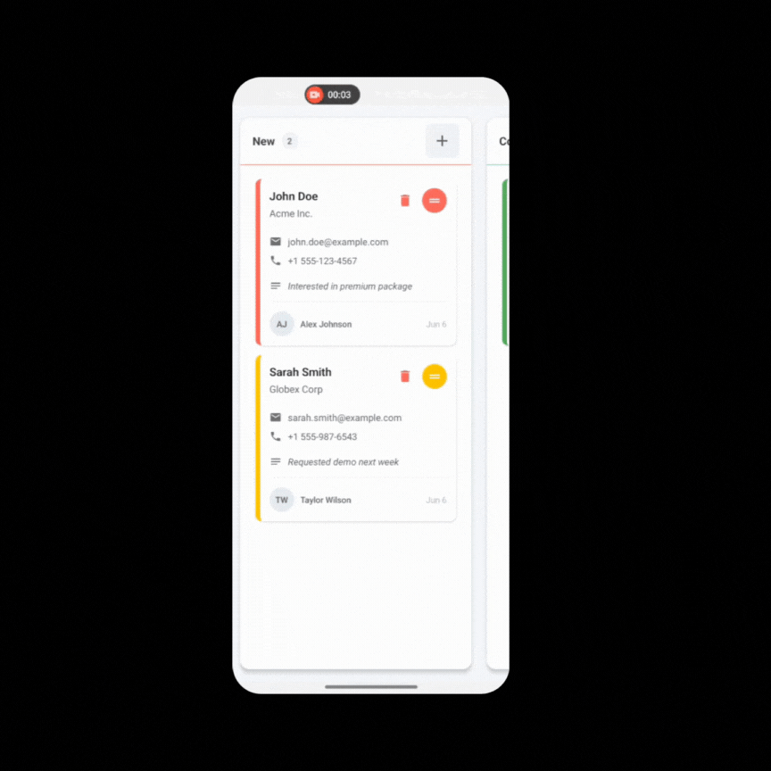

# React-Native-Expo-Kanban

<div>
<div align="center">
  <br />
    <a href="https://github.com/NaveenMathramkott/Ryvon" target="_blank">
        
    </a>
  <br />

  <div>
    
    
     </div>
  </div>

<h3 align="center">React Native Expo Kanban</h3>

   <div align="center">
An interactive Kanban board component for React Native applications. Perfect for task management, sales pipelines, project tracking, and any workflow that benefits from visual organization.
    
</div>

## Features

- 🎨 Customizable - Colors, styles, and behavior can be easily customized

- 📱 Mobile-friendly - Designed specifically for React Native

- ✋ Interactive - Drag-and-drop cards between columns

- ➕ Add items - Built-in support for adding new items to any column

- 🗑️ Delete items - Easy item deletion with confirmation

- 🏷️ Priority indicators - Visual priority levels for better organization

- 📊 Count tracking - Automatic count of items per column

- 🔄 State management - Easy integration with your existing state

## Installation

```bash
npm install react-native-expo-kanban react-native-reanimated
```

react-native-reanimated must be also installed: https://docs.swmansion.com/react-native-reanimated/docs/fundamentals/getting-started/

## Usage

Import the necessary components and types:

```bash
import ReactNativeKanbanBoard from "react-native-expo-kanban";
```

Define the columns and cards:

```tsx
const boardHeaderData = [
  { id: 1, status: "New", color: "#FF6B6B", is_end: false },
  { id: 2, status: "Contacted", color: "#4ECDC4", is_end: false },
  { id: 3, status: "Qualified", color: "#45B7D1", is_end: false },
];
const [boardCardData, setBoardCardData] = useState({
  "1": {
    leads: [
      {
        id: 101,
        first_name: "John",
        last_name: "Doe",
        email: "john.doe@example.com",
        phone: "+1 555-123-4567",
        company: "Acme Inc.",
        created_on: new Date().toISOString(),
        priority: "high",
        status: "New",
        notes: "Interested in premium package",
        assigned_to: {
          first_name: "Alex",
          last_name: "Johnson",
          profile_pic: null,
        },
      },
      {
        id: 102,
        first_name: "Sarah",
        last_name: "Smith",
        email: "sarah.smith@example.com",
        phone: "+1 555-987-6543",
        company: "Globex Corp",
        created_on: new Date().toISOString(),
        priority: "medium",
        status: "New",
        notes: "Requested demo next week",
        assigned_to: {
          first_name: "Taylor",
          last_name: "Wilson",
          profile_pic: null,
        },
      },
    ],
    total_count: 2,
  },
  "2": {
    leads: [
      {
        id: 201,
        first_name: "Mike",
        last_name: "Brown",
        email: "mike.brown@example.com",
        phone: "+1 555-456-7890",
        company: "Tech Solutions",
        created_on: new Date().toISOString(),
        priority: "low",
        status: "Contacted",
        notes: "Follow up in 2 days",
        assigned_to: {
          first_name: "Jordan",
          last_name: "Lee",
          profile_pic: null,
        },
      },
    ],
    total_count: 1,
  },
  "3": {
    leads: [],
    total_count: 0,
  },
});
```

Render the Kanban Board component:

```tsx
<ReactNativeKanbanBoard
  boardHeaderData={boardHeaderData}
  boardCardData={boardCardData}
  onBoardChange={setBoardCardData}
/>
```

### Props

| Prop            | Type                                      | Default | Description                              | Required |
| --------------- | ----------------------------------------- | ------- | ---------------------------------------- | -------- |
| boardHeaderData | BoardHeader[ ]                            | []      | Defines the columns in your Kanban board | Yes      |
| boardCardData   | BoardCardData                             | {}      | Contains the cards for each column       | Yes      |
| onBoardChange   | (newData: BoardCardData) => void          |         | Callback when board data changes         | Yes      |
| onCardPress     | (card: CardData) => void                  |         | Callback when a card is pressed          | No       |
| onAddCard       | (boardId: string) => void                 |         | Callback when add button is pressed      | No       |
| onDeleteLead    | (leadId: string, boardId: string) => void |         | Callback when delete is requested        | No       |
| priorityColors  | Record<string, string>                    |         | Custom colors for priority levels        | No       |
| cardStyle       | ViewStyle                                 |         | Custom styles for cards                  | No       |

### Types

```tsx
interface BoardStatus {
  id: string;
  status: string;
  color: string;
  is_end: boolean;
}

interface CardData {
  id: string;
  first_name: string;
  last_name: string;
  company: string;
  email: string;
  phone: string;
  notes?: string;
  status?: string;
  priority: string;
  created_on: string;
  assigned_to: {
    first_name: string;
    last_name?: string;
  };
}

interface BoardCardData {
  [boardId: string]: {
    leads: CardData[];
    total_count: number;
  };
}
```

#### Sharing is caring... until someone finds out. Happy Coding

---
